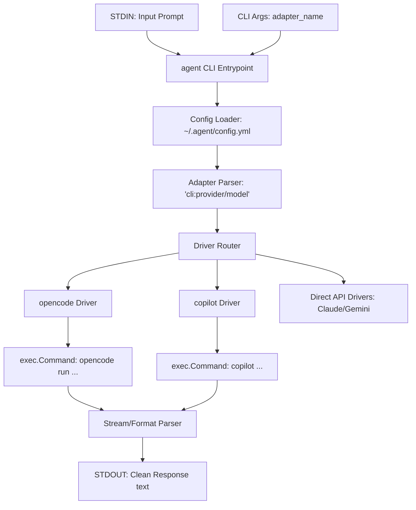

# Design: Bootstrap Centralized `agent` CLI Tool

## User Story
* **Headline**: Centralized CLI-based Agent Router for LLM Pipelines.
* **Problem Statement**: 
  Currently, both `breakdown` and `build` duplicate code for parsing `agent_adapter` configurations, executing external LLM command-line clients (such as `opencode` or `copilot`), managing streaming output, and formatting response data. Adding new LLM clients requires updating multiple downstream tools, creating maintenance overhead and design duplication.
* **Objective**:
  Create an independent, lightweight, Go-based CLI program named `agent` that acts as a unified facade for any under-the-hood LLM CLI or direct API. It will load named configurations from `~/.agent/config.yml` and accept prompts piped directly via STDIN, streaming the final clean text output to STDOUT.
* **Expected Outcome**:
  Users can configure multiple adapters in a single YAML file and invoke any configured LLM using standard Unix pipes:
  ```bash
  echo "What is the capital of France?" | agent primary
  # Output: Paris
  ```

---

## Architecture Overview



### 1. Configuration (`~/.agent/config.yml`)
A simple key-value YAML file mapping user-defined, named adapters to their target CLI specifications.
```yaml
primary: "opencode:google/gemini-3.5-flash"
fast: "copilot:anthropic/claude-haiku-4.5"
claude: "claude:anthropic/claude-3-5-sonnet"
```

### 2. Module Boundaries
* `main.go`: Read argument, read `stdin`, print output, handle errors and exit codes.
* `pkg/config/`: Locates and parses `~/.agent/config.yml`. Supports overrides via environment variables.
* `pkg/adapter/`: Splits target strings (e.g., `opencode:google/gemini-3.5-flash`) into `CLIName`, `Provider`, and `Model`.
* `pkg/runner/`:
  * `Runner` interface: `Run(ctx context.Context, model string, prompt string) (string, error)`
  * `OpencodeRunner`: Invokes `opencode` subprocess, handles token stream aggregation, and extracts clean output.
  * `CopilotRunner`: Invokes `copilot` subprocess, sanitizes formatting, and returns raw text.

---

## Implementation Backlog

### Pending
- [ ] **Task 2: Configuration Loader (`pkg/config/`)**
  - Implement parsing of `~/.agent/config.yml`.
  - Handle missing files gracefully (e.g., return clear instructions on how to initialize it).
- [ ] **Task 3: Adapter Specification Parser (`pkg/adapter/`)**
  - Implement parsing of the format `cliName:provider/model` into distinct variables.
  - Standardize error messages for invalid formats.
- [ ] **Task 4: CLI Input Handler (`main.go`)**
  - Read positional argument for adapter name.
  - Read prompt from STDIN buffer.
  - Support a `--verbose` flag to emit underlying driver logs or timing to STDERR.
- [ ] **Task 5: Runner Interface & Opencode Driver**
  - Implement runner routing mechanism.
  - Implement the `opencode` driver by executing `opencode run "<prompt>" --model <model> --format json` and parsing/aggregating the JSON stream line-by-line.
- [ ] **Task 6: Copilot Driver**
  - Implement the `copilot` driver by executing `copilot -s -p "<prompt>" --excluded-tools=* --model <model>` and cleaning up the output.
- [ ] **Task 7: End-to-End Piping Integration & CLI Packaging**
  - Hook everything up in `main.go`.
  - Provide a script/binary build process and end-to-end automated pipeline tests.

### Current
- [ ] **Task 1: Project Initialization & Repository Setup**
  - Initialize git repository and module `github.com/jefflunt/agent`.
  - Create standard file structure.

### Completed
*None*

---

## Checklist & TDD Requirements

### Unit Testing Requirements
1. **Config Test**: Verify that nested/flat named configs load correctly. Ensure trailing spaces, inline comments, and quotes are correctly stripped.
2. **Adapter Test**: Assert parsing of various valid strings (including spaced elements) and precise failure conditions on invalid structures.
3. **Driver Test**: Mock subprocess execution using custom runners or standard mock execution frameworks to prove that `opencode` stream parsing correctly aggregates partial tokens into clean output without shelling out to actual systems during tests.
4. **Piping E2E Test**: Test the whole flow with mocked sub-processes to prove that STDIN flows to STDOUT with exit code 0.
