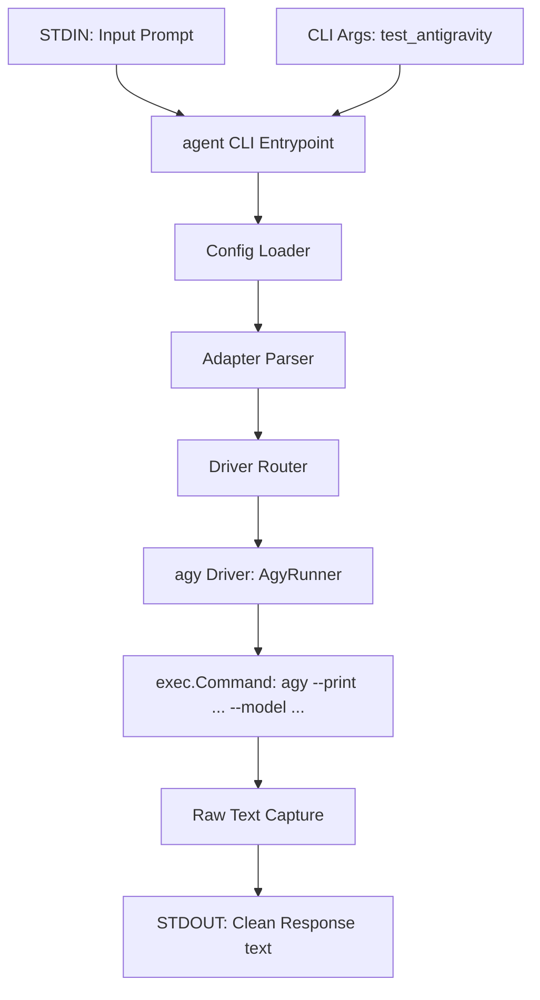

# Design: Implement Google Antigravity CLI Driver (`AgyRunner`)

## User Story
* **Headline**: Integrated Google Antigravity CLI Subprocess Driver.
* **Problem Statement**:
  Users want to be able to use the Google Antigravity ecosystem through the native `agy` CLI. To enable this, we need a native `AgyRunner` driver registered in our centralized routing registry.
* **Objective**:
  Implement an `AgyRunner` within `pkg/runner` that satisfies the `Runner` interface, executes the `agy` CLI with `--print` and `--model <model>`, and returns the clean response.
* **Expected Outcome**:
  Users can configure `test_antigravity: "agy:google/gemini-3.5-flash"` and run tasks via:
  ```bash
  echo "What is 2+2?" | agent test_antigravity
  # Output: 2 + 2 = 4
  ```

---

## Architecture Overview



### 1. The Agy CLI Command Structure
To invoke the `agy` CLI driver non-interactively without allowing tool executions, we run:
```bash
agy --print "<prompt>" --model <model>
```
* **Model Handling**: To support consistent configurations and keep formatting details inside the driver, `AgyRunner` will receive the model argument from `main.go`. Since the `agy` CLI is flexible and accepts both provider-qualified model names (like `google/gemini-3.5-flash`) and bare model names, `AgyRunner` can pass the model parameter directly to `--model`.

### 2. Module Changes
* **`pkg/runner/runner.go`**:
  * Implement `AgyRunner` struct conforming to `Runner` interface:
    ```go
    type AgyRunner struct {
        Executable     string
        CommandFactory func(ctx context.Context, name string, args ...string) Command
    }
    ```
  * In `init()`, register `agy` with `&AgyRunner{}`.
* **`pkg/runner/agy_test.go`**:
  * Implement standard subprocess mocks and assertions for `AgyRunner`.
* **`~/.agent/config.yml`**:
  * Add the following entry to the configuration file:
    ```yaml
    test_antigravity: "agy:google/gemini-3.5-flash"
    ```

---

## Implementation Backlog

### Pending
*None*

### Current
*None*

### Completed
- [x] **Task 1: Implement `AgyRunner` and Unit Tests (`pkg/runner/agy_test.go`)**
  - Created `agy_test.go` and implemented unit tests covering:
    - Successful execution and output aggregation.
    - Defaulting the executable name to `"agy"`.
    - Handling subprocess start & exit errors.
  - Implemented the full `AgyRunner.Run` method inside `pkg/runner/runner.go` with async streams.
  - Registered the runner under key `"agy"` in `init()`.
- [x] **Task 2: Update `~/.agent/config.yml` with `test_antigravity`**
  - Successfully updated configuration file and verified proper format.
- [x] **Task 3: End-to-End Verification with `test_antigravity`**
  - Executed a prompt through `test_antigravity` end-to-end to verify functionality.
  - Successfully verified execution of Google Antigravity CLI with `--print` and `--model google/gemini-3.5-flash`.

---

## Checklist & TDD Requirements

### Unit Testing Requirements
1. **Runner Test**: Prove that `AgyRunner` correctly executes with `--print` and `--model`.
2. **Subprocess Failure Test**: Prove that subprocess startup or exit failures are handled gracefully and wrapped in context-rich errors.
