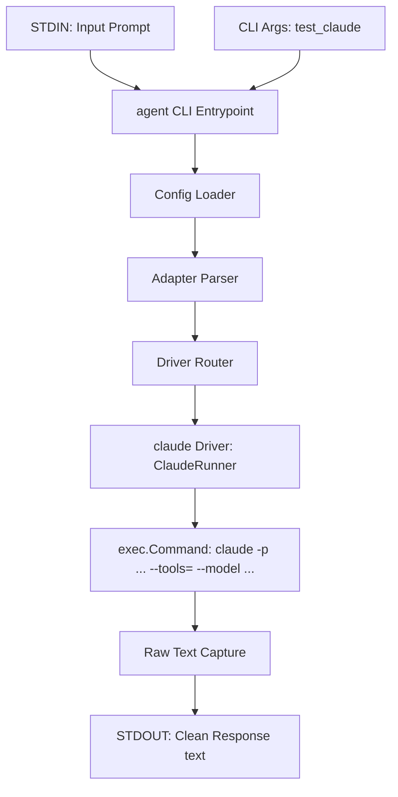

# Design: Implement Claude CLI Driver (`ClaudeRunner`)

## User Story
* **Headline**: Integrated Claude Code Subprocess Driver.
* **Problem Statement**:
  Currently, the `agent` CLI only supports `opencode` and `copilot` drivers. Users want to use the native `claude` (Claude Code) CLI driver directly to route prompts, which supports advanced Anthropic models and highly optimized non-interactive execution.
* **Objective**:
  Implement a `ClaudeRunner` within `pkg/runner` that satisfies the `Runner` interface, executes the `claude` CLI with `--print` (`-p`), `--tools=""`, and `--model <model>`, and returns the clean response.
* **Expected Outcome**:
  Users can specify `test_claude: "claude:anthropic/claude-sonnet-4-5"` (or similar supported Claude models like `claude-sonnet-4-5` or `sonnet`) and run tasks via:
  ```bash
  echo "What is 2+2?" | agent test_claude
  # Output: 4
  ```

---

## Architecture Overview



### 1. The Claude CLI Command Structure
To invoke the `claude` CLI driver non-interactively without allowing tool executions, we run:
```bash
claude -p "<prompt>" --tools="" --model <model>
```
* Note: Just like `CopilotRunner`, `ClaudeRunner` expects the bare model name (e.g. `claude-sonnet-4-5` or `sonnet`). If a fully-qualified model name (e.g. `anthropic/claude-sonnet-4-5`) is passed from `main.go`, the `ClaudeRunner` will strip the provider prefix.

### 2. Module Changes
* **`pkg/runner/runner.go`**:
  * Implement `ClaudeRunner` struct conforming to `Runner` interface:
    ```go
    type ClaudeRunner struct {
        Executable     string
        CommandFactory func(ctx context.Context, name string, args ...string) Command
    }
    ```
  * In `init()`, register `claude` with `&ClaudeRunner{}`.
* **`pkg/runner/claude_test.go`**:
  * Implement standard subprocess mocks and assertions for `ClaudeRunner`.

---

## Implementation Backlog

### Pending
*None*

### Current
*None*

### Completed
- [x] **Task 1: Implement `ClaudeRunner` and Unit Tests (`pkg/runner/claude_test.go`)**
  - Created `claude_test.go` and implemented unit tests covering:
    - Successful execution and output aggregation.
    - Defaulting the executable name to `"claude"`.
    - Handling subprocess start & exit errors.
    - Stripping the provider prefix from qualified model parameters.
  - Implemented the full `ClaudeRunner.Run` method inside `pkg/runner/runner.go` with prefix-stripping and async stdout/stderr streaming.
  - Registered the runner under key `"claude"` in `init()`.
- [x] **Task 2: End-to-End Verification with `test_claude`**
  - Executed a prompt through `test_claude` end-to-end to verify functionality.
  - Successfully verified execution of Claude Code with `-p`, `--tools=""`, and `--model claude-sonnet-4-6`.

---

## Checklist & TDD Requirements

### Unit Testing Requirements
1. **Runner Test**: Prove that `ClaudeRunner` correctly executes with `-p`, `--tools=""`, and the stripped model name.
2. **Provider Stripping Test**: Verify that passing a provider-qualified name like `anthropic/claude-sonnet-4-5` successfully strips down to `claude-sonnet-4-5`.
3. **Subprocess Failure Test**: Prove that subprocess startup or exit failures are handled gracefully and wrapped in context-rich errors.
