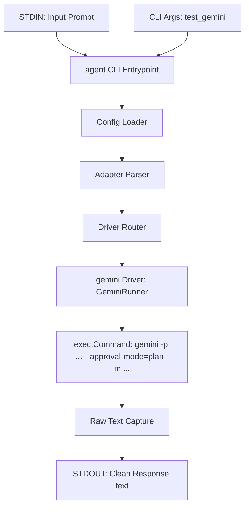

# Design: Implement Gemini CLI Driver (`GeminiRunner`)

## User Story
* **Headline**: Integrated Gemini CLI Subprocess Driver.
* **Problem Statement**:
  Users want to be able to use the Google Gemini ecosystem through the native `gemini` CLI. To avoid code duplication and ensure standard pipeline piping, we need a native `GeminiRunner` driver in our router.
* **Objective**:
  Implement a `GeminiRunner` within `pkg/runner` that satisfies the `Runner` interface, executes the `gemini` CLI with `-p`, `--approval-mode=plan`, and `-m <model>`, and returns the clean response.
* **Expected Outcome**:
  Users can specify `test_gemini: "gemini:google/gemini-3.5-flash"` and run tasks via:
  ```bash
  echo "What is 2+2?" | agent test_gemini
  # Output: 4
  ```

---

## Architecture Overview



### 1. The Gemini CLI Command Structure
To invoke the `gemini` CLI driver non-interactively without allowing tool executions, we run:
```bash
gemini -p "<prompt>" --approval-mode=plan -m <model>
```
* **Model Handling**: Just like `CopilotRunner` and `ClaudeRunner`, `GeminiRunner` expects the bare model name (e.g. `gemini-3.5-flash`). If a fully-qualified model name (e.g. `google/gemini-3.5-flash`) is passed, `GeminiRunner` will strip the provider prefix.
* **Environment Credentials**: The `gemini` CLI requires the `GEMINI_API_KEY` environment variable. To provide a seamless user experience, if `GEMINI_API_KEY` is not set but `GEMINI_KEY` is present in the parent environment, `GeminiRunner` will automatically propagate `GEMINI_API_KEY=<GEMINI_KEY>` to the subprocess environment.

### 2. Module Changes
* **`pkg/runner/runner.go`**:
  * Implement `GeminiRunner` struct conforming to `Runner` interface:
    ```go
    type GeminiRunner struct {
        Executable     string
        CommandFactory func(ctx context.Context, name string, args ...string) Command
    }
    ```
  * In `init()`, register `gemini` with `&GeminiRunner{}`.
* **`pkg/runner/gemini_test.go`**:
  * Implement standard subprocess mocks and assertions for `GeminiRunner`.

---

## Implementation Backlog

### Pending
*None*

### Current
*None*

### Completed
- [x] **Task 1: Implement `GeminiRunner` and Unit Tests (`pkg/runner/gemini_test.go`)**
  - Created `gemini_test.go` and implemented unit tests covering:
    - Successful execution and output aggregation.
    - Defaulting the executable name to `"gemini"`.
    - Handling subprocess start & exit errors.
    - Stripping the provider prefix from qualified model parameters.
    - Fallback credentials propagation of `GEMINI_KEY` to `GEMINI_API_KEY`.
  - Implemented the full `GeminiRunner.Run` method inside `pkg/runner/runner.go` with prefix-stripping, credential propagation, and async streams.
  - Registered the runner under key `"gemini"` in `init()`.
- [x] **Task 2: End-to-End Verification with `test_gemini`**
  - Executed a prompt through `test_gemini` end-to-end to verify functionality.
  - Successfully verified execution of Gemini CLI with `-p`, `--approval-mode=plan`, and `--model gemini-3.5-flash`.
  - Verified automatic propagation of global `GEMINI_KEY` into `GEMINI_API_KEY` environment variable on the subprocess.

---

## Checklist & TDD Requirements

### Unit Testing Requirements
1. **Runner Test**: Prove that `GeminiRunner` correctly executes with `-p`, `--approval-mode=plan`, and the stripped model name.
2. **Provider Stripping Test**: Verify that passing a provider-qualified name like `google/gemini-3.5-flash` successfully strips down to `gemini-3.5-flash`.
3. **Subprocess Failure Test**: Prove that subprocess startup or exit failures are handled gracefully and wrapped in context-rich errors.
