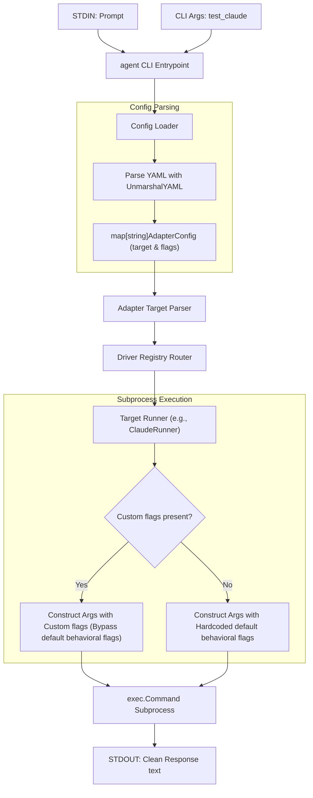

# Design: Support Per-LLM CLI Flags in Configuration

## User Story
* **Headline**: Configurable Per-LLM/Adapter CLI Flags.
* **Problem Statement**:
  Users of `agent` want to customize behavioral flags passed to the underlying LLM CLI drivers (such as `claude` or `copilot`). For example, they may want to alter things like available tools (using `--tools` in Claude Code) or permission settings. Currently, these CLI flags are hardcoded within each runner implementation.
* **Objective**:
  Structure the configuration file format to support custom, per-adapter `flags`. Ensure the runner execution engine handles these flags and passes them to the underlying subprocess CLI tool, bypassing hardcoded runner-level default behavioral flags if custom flags are provided.
* **Expected Outcome**:
  Users can define their configuration using a nested map with `target` and `flags` keys:
  ```yaml
  adapters:
    # Existing backward-compatible flat string format
    test_opencode: "opencode:google/gemini-3.5-flash"

    # New nested configuration format with custom flags
    test_claude:
      target: "claude:anthropic/claude-sonnet-4-6"
      flags:
        - "--tools=web,bash"
        - "--permissions=read-only"
  ```
  Running `echo "What is 2+2?" | agent test_claude` will execute the `claude` binary with the user's custom tools and permissions flags instead of the hardcoded default flags.

---

## Architecture Overview



### 1. Schema Design
The adapter configuration format will change from a flat `map[string]string` to `map[string]AdapterConfig`.
```go
type AdapterConfig struct {
	Target string   `yaml:"target"`
	Flags  []string `yaml:"flags"`
}
```
To support both the existing simple string values and the new nested struct values under `adapters`, we implement a custom `UnmarshalYAML` method on `AdapterConfig`:
- If the node is a Scalar Node (string), parse it into `Target` and leave `Flags` as `nil`.
- If the node is a Mapping Node (struct), parse it directly into `Target` and `Flags`.

### 2. Flag Interaction Rules (Option C: Complete Control)
When custom flags are specified in the configuration, they replace the driver's hardcoded *optional/behavioral* flags, while retaining the *structural* flags (like prompt parameter and model parameter) required to successfully run the CLI.

#### Driver Integration Matrix:

| Driver | Structural Parameters | Default Behavioral Flags (Bypassed if custom flags provided) | Custom Args Structure |
| :--- | :--- | :--- | :--- |
| **`opencode`** | `run <prompt> --model <model>` | `--format json` | `run <prompt> --model <model> [custom_flags...]` |
| **`copilot`** | `-p <prompt> --model <model>` | `-s`, `--excluded-tools=*` | `-p <prompt> --model <model> [custom_flags...]` |
| **`claude`** | `-p <prompt> --model <model>` | `--tools=""` | `-p <prompt> --model <model> [custom_flags...]` |
| **`gemini`** | `-p <prompt> -m <model>` | `--approval-mode=plan` | `-p <prompt> -m <model> [custom_flags...]` |
| **`agy`** | `--print <prompt> --model <model>` | *None* | `--print <prompt> --model <model> [custom_flags...]` |

---

## Implementation Backlog

### Pending
*None*

### Current
*None*

### Completed
- [x] **Task 1: Restructure Configuration Layer and Update Tests**
  - Add `AdapterConfig` to `pkg/config/config.go` with custom `UnmarshalYAML` support.
  - Update `Config` struct's `Adapters` map to `map[string]AdapterConfig`.
  - Add unit tests in `pkg/config/config_test.go` verifying:
    - Loading flat adapters (simple string target).
    - Loading nested adapters (target and flags).
    - Handling configuration loading errors.
- [x] **Task 2: Update Runner Interface and Driver Run Methods**
  - Update `Runner` interface in `pkg/runner/runner.go` to accept `flags []string`:
    ```go
    type Runner interface {
        Run(ctx context.Context, model string, prompt string, flags []string) (string, error)
    }
    ```
  - Update all runner implementations and their tests to match the new signature:
    - `OpencodeRunner`: update `Run` and tests in `runner_test.go`. Ensure default behavioral flags (`--format json`) are omitted when custom flags are provided.
    - `CopilotRunner`: update `Run` and tests in `copilot_test.go`. Ensure defaults (`-s`, `--excluded-tools=*`) are omitted when custom flags are provided.
    - `ClaudeRunner`: update `Run` and tests in `claude_test.go`. Ensure default (`--tools=""`) is omitted when custom flags are provided.
    - `GeminiRunner`: update `Run` and tests in `gemini_test.go`. Ensure default (`--approval-mode=plan`) is omitted when custom flags are provided.
    - `AgyRunner`: update `Run` and tests in `agy_test.go`. Ensure custom flags are appended.
- [x] **Task 3: Update CLI Integration and End-to-End Tests**
  - Update `cmd/agent/main.go` to retrieve the target and flags from `AdapterConfig` and pass `flags` to the resolved runner.
  - Update CLI tests in `cmd/agent/main_test.go` to verify correct loading and flag forwarding.
  - Perform final verification testing and document new features.
*None*

---

## Checklist & TDD Requirements

### Unit Testing Requirements
1. **Config Unmarshal Test**: Write tests proving that `AdapterConfig` correctly decodes both scalar string targets (backward-compatible) and structural YAML targets with string-slice flags.
2. **Runner Signature Update Test**: Prove that all five runners compile and execute successfully with the new `Run` signature.
3. **Runner Custom Flag Override Test**: For each runner, write tests proving that:
   - When **no** custom flags are provided, the runner executes with its hardcoded default behavioral flags.
   - When custom flags **are** provided, the runner executes *without* its hardcoded default behavioral flags, and instead appends the user-specified custom flags.
4. **CLI Integration Test**: Verify that the CLI entrypoint successfully passes config-defined custom flags into the runner execution call.
